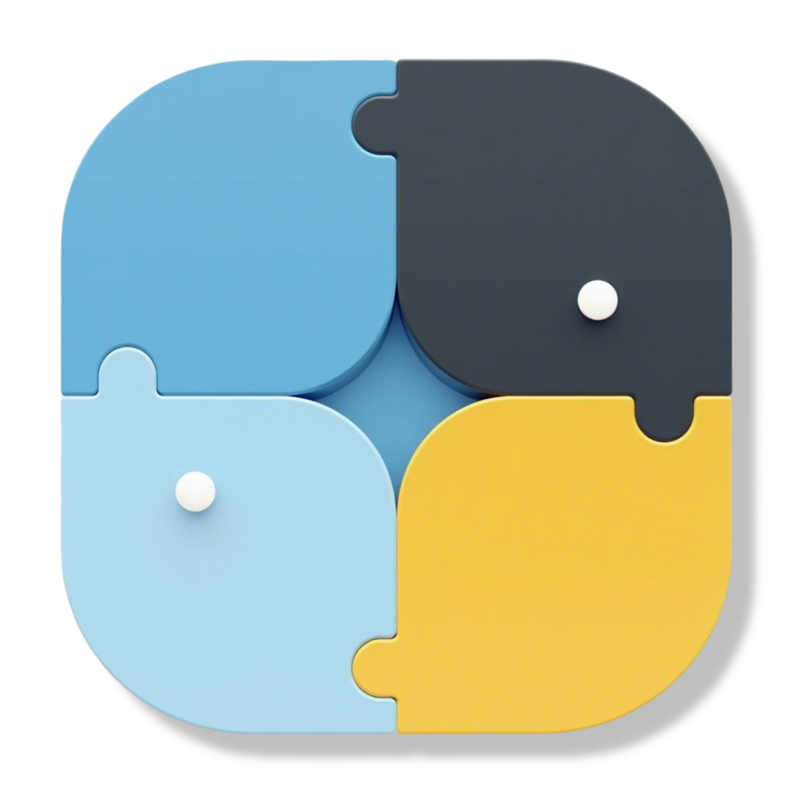

> **Disclaimer:**  This extension is currently in an **experimental state**.
> While functional, it may contain unstable features, unexpected behavior, or breaking changes in future releases.
> Use with appropriate caution in non-production environments.

# DuckDB  GraphAr

A [DuckDB](https://duckdb.org/) extension that enables reading data stored in the
[Apache GraphAr](https://graphar.apache.org) format.
It allows you to query vertex and edge tables using SQL, with support for simple filtering.

### Dependencies

This extension requires the following dependencies:

- [DuckDB](https://duckdb.org) - An in-process SQL OLAP database management system.
- [Apache GraphAr](https://graphar.apache.org/) - An open source, standard data file format for graph data storage and retrieval.
- [Apache Arrow](https://arrow.apache.org) - A cross-language development platform for in-memory data.

### Build extension:

Development Build:
```bash
mkdir build && cd build
cmake .. -DLOAD_TESTS=ON
make
```
