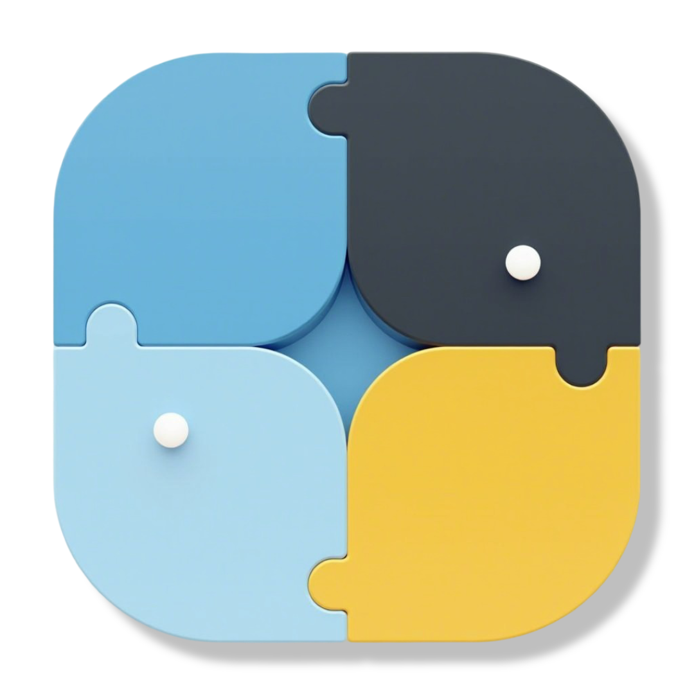

> **Disclaimer:**  This extension is currently in an **experimental state**.
> While functional, it may contain unstable features, unexpected behavior, or breaking changes in future releases.
> Use with appropriate caution in non-production environments.

# DuckDB  GraphAr

A [DuckDB](https://duckdb.org/) extension that enables reading data stored in the
[Apache GraphAr](https://graphar.apache.org) format.
It allows you to query vertex and edge tables using SQL, with support for simple filtering.

### DeepWiki

A high-level introduction to the DuckDB GraphAr extension, explaining its architecture and key components, as well as a description of the overall system design, major subsystems, and how they integrate to enable SQL querying of Apache GraphAr data through DuckDB is contained in the [DeepWiki](https://deepwiki.com/lithium-tech/duckdb-graphar)

### Dependencies

This extension requires the following dependencies:

- [DuckDB](https://duckdb.org) - An in-process SQL OLAP database management system.
- [Apache GraphAr](https://graphar.apache.org/) - An open source, standard data file format for graph data storage and retrieval.
- [Apache Arrow](https://arrow.apache.org) - A cross-language development platform for in-memory data.

## SAST Tools

- [Cppcheck](https://cppcheck.sourceforge.io/) - static analysis tool for C/C++ code
- [PVS-Studio](https://pvs-studio.com/pvs-studio/?utm_source=website&utm_medium=github&utm_campaign=open_source) - static analyzer for C, C++, C#, and Java code.

## Building From Source

```shell
# Clone the repo and its dependencies
git clone --recurse-submodules git@github.com:lithium-tech/duckdb-graphar.git
```

Initialize submodules before building:

```shell
git submodule update --init --recursive
```

### Build extension

Build the extension:

```shell
make release
```

For a debug build:

```shell
make debug
```

### Run the extension

After building, the `duckdb` binary (with the extension statically linked) is
produced at `build/release/duckdb`. Launch it and attach to a GraphAr graph
directory to query its vertex/edge tables:

```bash
./build/release/duckdb -c "attach '/path/to/Graph.yaml' (type duckdb_graphar); select * from person limit 20;"
```

Example data is available under `data/` (e.g. `data/snap-musae-github/graphar/Git.graph.yaml`).

### S3 warning note

When using S3-backed data, DuckDB may print the warning

```
arrow::fs::FinalizeS3 was not called even though S3 was initialized. This could
lead to a segmentation fault at exit
```

This is a **known harmless** issue — it is not a bug (see AGENTS.md). However, if
needed, you can prevent a possible segmentation fault on exit by calling the
`duckdb_graphar_finalize_s3()` function (registered by this extension) to explicitly
finalize the S3 filesystem before the process ends.

### Run unit tests

The extension has its own Catch2-based unit-test binary, `unittest_graphar`.
It links against `duckdb_static` (plus the generated extension loader and the
extension's static libraries), so it does not depend on symbols being exported
from the shared `libduckdb.so`.

The tests are built as part of the release/debug build (see the `ENABLE_UNIT_TESTS`
option below). Run them with:

```bash
make test
```

or invoke the binary directly:

```bash
./build/release/extension/duckdb_graphar/tests/unittest_graphar
```

#### Test configuration options

Unit tests are enabled by default through the Makefile
(`EXT_RELEASE_FLAGS`/`EXT_DEBUG_FLAGS` pass `-DENABLE_UNIT_TESTS=ON`).
If you build with CMake directly and want to control this:

```shell
cmake ... -DENABLE_UNIT_TESTS=ON   # build the extension unit tests
cmake ... -DENABLE_UNIT_TESTS=OFF  # skip the extension unit tests
```
